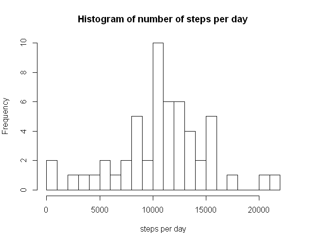
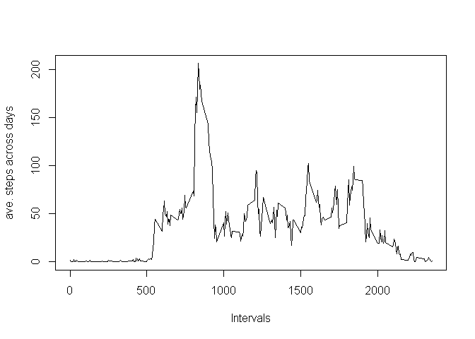
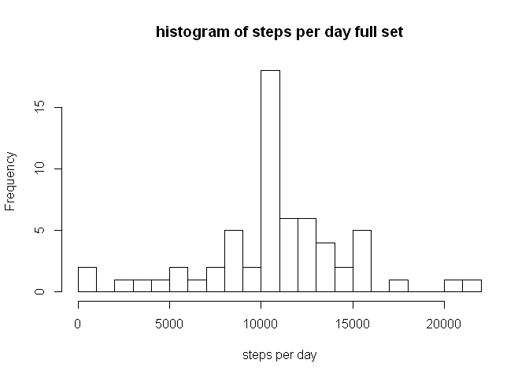
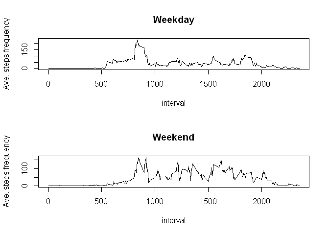

# Reproducible Research: Peer Assessment 1


## Loading and preprocessing the data  

### 1. load the data and library

```r
setwd("F:/Users/Macbook/Desktop/Data Science/5.Reproducible data")
src.data <- read.csv(file='activity.csv', as.is=TRUE)
data <- src.data # keep copy of original data set
library(plyr)
```
### 2. format the data

```r
data[,2] <- as.Date(src.data[,2], "%Y-%m-%d")
data <- data[complete.cases(data),]
```

  

## What is mean total number of steps taken per day?
### 1. total number of steps taken per day

```r
steps.per.day <- ddply(data, .(date), summarize, total=sum(steps))
```

```r
steps.per.day
```

```
##          date total
## 1  2012-10-02   126
## 2  2012-10-03 11352
## 3  2012-10-04 12116
## 4  2012-10-05 13294
## 5  2012-10-06 15420
## 6  2012-10-07 11015
## 7  2012-10-09 12811
## 8  2012-10-10  9900
## 9  2012-10-11 10304
## 10 2012-10-12 17382
## 11 2012-10-13 12426
## 12 2012-10-14 15098
## 13 2012-10-15 10139
## 14 2012-10-16 15084
## 15 2012-10-17 13452
## 16 2012-10-18 10056
## 17 2012-10-19 11829
## 18 2012-10-20 10395
## 19 2012-10-21  8821
## 20 2012-10-22 13460
## 21 2012-10-23  8918
## 22 2012-10-24  8355
## 23 2012-10-25  2492
## 24 2012-10-26  6778
## 25 2012-10-27 10119
## 26 2012-10-28 11458
## 27 2012-10-29  5018
## 28 2012-10-30  9819
## 29 2012-10-31 15414
## 30 2012-11-02 10600
## 31 2012-11-03 10571
## 32 2012-11-05 10439
## 33 2012-11-06  8334
## 34 2012-11-07 12883
## 35 2012-11-08  3219
## 36 2012-11-11 12608
## 37 2012-11-12 10765
## 38 2012-11-13  7336
## 39 2012-11-15    41
## 40 2012-11-16  5441
## 41 2012-11-17 14339
## 42 2012-11-18 15110
## 43 2012-11-19  8841
## 44 2012-11-20  4472
## 45 2012-11-21 12787
## 46 2012-11-22 20427
## 47 2012-11-23 21194
## 48 2012-11-24 14478
## 49 2012-11-25 11834
## 50 2012-11-26 11162
## 51 2012-11-27 13646
## 52 2012-11-28 10183
## 53 2012-11-29  7047
```

### 2. histogram of total steps per day

```r
par(mar = rep(4, 4))
hist(steps.per.day[,2], breaks=20, 
     main="Histogram of number of steps per day", xlab="steps per day")
```

 

### 3. mean and median of total steps per day
From the summary below, we observe that the mean equals 10766
and the median equals 10765.

```r
summary(steps.per.day)
```

```
##       date                total      
##  Min.   :2012-10-02   Min.   :   41  
##  1st Qu.:2012-10-16   1st Qu.: 8841  
##  Median :2012-10-29   Median :10765  
##  Mean   :2012-10-30   Mean   :10766  
##  3rd Qu.:2012-11-16   3rd Qu.:13294  
##  Max.   :2012-11-29   Max.   :21194
```
  
## What is the average daily activity pattern?
## 1. time interval (x-axis) vs averaged steps count across all days (y-axis)

```r
# mean steps count grouped by interval
ave.steps.per.interval <- ddply(data, .(interval), summarize, ave.steps=mean(steps))
plot(ave.steps.per.interval[,1], ave.steps.per.interval[,2], type='l'
     , xlab="Intervals", ylab="ave. steps across days")
```

 

### 2. which interval has max number of steps
From the summary below, we observe that the interval with max number of steps is of rounded value 206.170. And the interval with this max count is 835.

```r
summary(ave.steps.per.interval)
```

```
##     interval        ave.steps      
##  Min.   :   0.0   Min.   :  0.000  
##  1st Qu.: 588.8   1st Qu.:  2.486  
##  Median :1177.5   Median : 34.113  
##  Mean   :1177.5   Mean   : 37.383  
##  3rd Qu.:1766.2   3rd Qu.: 52.835  
##  Max.   :2355.0   Max.   :206.170
```

```r
interval.max <- subset(ave.steps.per.interval, ave.steps.per.interval[,2]<207 & ave.steps.per.interval[,2]>206)
interval.max
```

```
##     interval ave.steps
## 104      835  206.1698
```

  
## Imputing missing values
### 1. total number of missing values

```r
# total rows of original data set, minus total rows of complete data set.
na.rows <- nrow(src.data)-nrow(data)
na.rows
```

```
## [1] 2304
```

### 2. devise strategy to replace all NA
We shall use the mean for each interval calculated earlier across all the days, to substitute each value in each respective 'NA' interval.

```r
# create a clean copy of data to modify on
modify.data <- src.data

# let us find out interval count to be used in below's 'FOR' loop. We find that this count is 288.
interval.count <- unique(modify.data$interval)
length(interval.count)
```

```
## [1] 288
```

```r
# we should also ensure that the values we use for replacement carry the full interval set
length(unique(data[,3]))
```

```
## [1] 288
```

### 3. create new dataset, replacing all NA with mean steps count

```r
counter <- 1 # initialise counter
for (i in 1:17568) {
        if(is.na(modify.data[i ,1]))
                modify.data[i, 1] <- ave.steps.per.interval[counter, 2]
        
        counter <- counter +1
        if(counter==289)
                counter <- 1 # reset counter
}
```
Original data had 'NA' values at the beginning. Now they should be gone.

```r
head(modify.data)
```

```
##       steps       date interval
## 1 1.7169811 2012-10-01        0
## 2 0.3396226 2012-10-01        5
## 3 0.1320755 2012-10-01       10
## 4 0.1509434 2012-10-01       15
## 5 0.0754717 2012-10-01       20
## 6 2.0943396 2012-10-01       25
```

### 4. histogram of number of steps each day

```r
# total steps count grouped by date
steps.per.day.full <- ddply(modify.data, .(date), summarize, steps.count=sum(steps))
hist(steps.per.day.full[,2], breaks=20, main="histogram of steps per day full set", 
     xlab="steps per day")
```

 


We can observe from the summary that the mean and median are both 10766 with the created full set of data. There is not much difference compared with first part of the assignment, because substituting with its own average values is likely to result in similar mean & median values.

```r
summary(steps.per.day.full)
```

```
##      date            steps.count   
##  Length:61          Min.   :   41  
##  Class :character   1st Qu.: 9819  
##  Mode  :character   Median :10766  
##                     Mean   :10766  
##                     3rd Qu.:12811  
##                     Max.   :21194
```
## Are there differences in activity patterns between weekdays and weekends?
### 1. create weekdays factor variable

```r
weekday <- weekdays(as.Date(modify.data$date), 1)
weekday <- as.data.frame(weekday, stringsAsFactors=FALSE) # keep them as string for substitution later
```


```r
# substitute values for weekday or weekend
for(i in 1:nrow(weekday)) {
        if(weekday[i,1]=="Sat" || weekday[i,1]=="Sun")
                weekday[i,1] <- "Weekend"
        else weekday[i,1] <- "Weekday"
}

weekday[,1] <- as.factor(weekday[,1]) # convert back to factor as required by assignment

modify.data <- cbind(modify.data, weekday)
```

### 2. interval (x-axis) vs ave. number of steps ave across weekdays (y-axis)
We subset the weekday results, group it by interval, then plot the 1st graph.
We then also subset the weekend results, group it by interval, then plot the 2nd graph.

```r
par(mfrow=c(2,1))

# 1st graph comes here
ave.steps.per.interval.weekday <- subset(modify.data, modify.data$weekday =="Weekday")
result1 <- ddply(ave.steps.per.interval.weekday, .(interval), summarize, mean(steps))

plot(result1[,1], result1[,2], type='l', main="Weekday", ylab="Ave. steps frequency",
     xlab="interval")

# 2nd graph comes here
ave.steps.per.interval.weekend <- subset(modify.data, modify.data$weekday =="Weekend")
result2 <- ddply(ave.steps.per.interval.weekend, .(interval), summarize, mean(steps))

plot(result2[,1], result2[,2], type='l', main="Weekend", ylab="Ave. steps frequency",
     xlab="interval")
```

 
